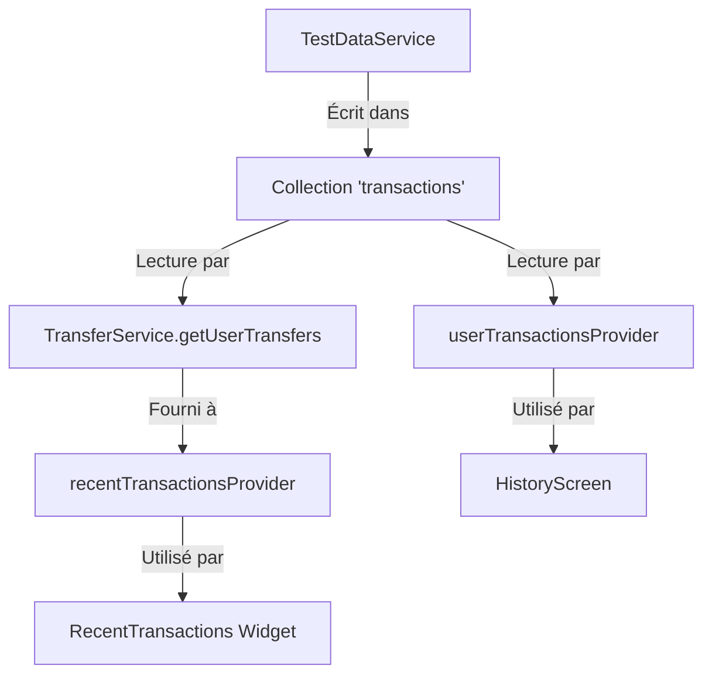

# 🔧 Corrections Appliquées pour Résoudre les Problèmes de Transactions

## 🚨 Problèmes Identifiés
1. **Transactions récentes vides** - Widget ne récupérait que les transferts envoyés
2. **Historique avec données en dur** - Providers utilisaient une logique complexe `asyncMap` 
3. **TestDataService** - Écrivait dans la bonne collection mais la logique de récupération était défaillante

## ✅ Solutions Implémentées

### 1. Simplification des Providers (`lib/data/providers/user_provider.dart`)

**AVANT:**
```dart
// Logique complexe avec asyncMap qui pouvait échouer
return sentTransfers.asyncMap((sent) async {
  final received = await receivedTransfers.first;
  final allTransfers = [...sent, ...received];
  // ...
});
```

**APRÈS:**
```dart
// Logique simplifiée - utilise directement getUserTransfers
return transferService.getUserTransfers(currentUser!.uid).map((transfers) {
  transfers.sort((a, b) => b.createdAt.compareTo(a.createdAt));
  return transfers.take(10).toList();
});
```

### 2. Mise à Jour du TransferService (`lib/data/services/transfer_service.dart`)

- ✅ `getUserTransfers()` récupère maintenant TOUTES les transactions de l'utilisateur
- ✅ Limite augmentée de 50 à 100 transactions
- ✅ Simplification de la logique de récupération

### 3. Ajout d'Outils de Debug

- ✅ Nouveau fichier `lib/debug/transaction_debugger.dart`
- ✅ Bouton "Debug Transactions" dans les paramètres
- ✅ Analyse complète du flux de données : Firestore → Service → Provider → Widget

## 🎯 Tests à Effectuer

1. **Connexion à l'application**
2. **Accès aux Paramètres → Debug → "Initialiser données de test"**
3. **Cliquer sur "Debug Transactions"** pour analyser le flux
4. **Vérifier les "Transactions récentes" sur la page d'accueil**
5. **Vérifier l'historique complet dans /history**

## 📊 Flux de Données Attendu



## 🔍 Points de Vérification

- [ ] Collection Firestore 'transactions' contient des données
- [ ] getUserTransfers() retourne des résultats non-vides
- [ ] recentTransactionsProvider fournit des données
- [ ] Widget RecentTransactions affiche les transactions
- [ ] HistoryScreen affiche l'historique complet

## 🚀 Prochaines Étapes si Problème Persiste

1. Lancer le debug avec le bouton dans les paramètres
2. Vérifier les logs de la console
3. S'assurer que l'utilisateur est bien connecté
4. Vérifier que les données de test sont créées avec le bon `senderId`
